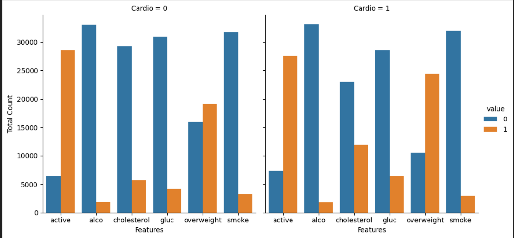
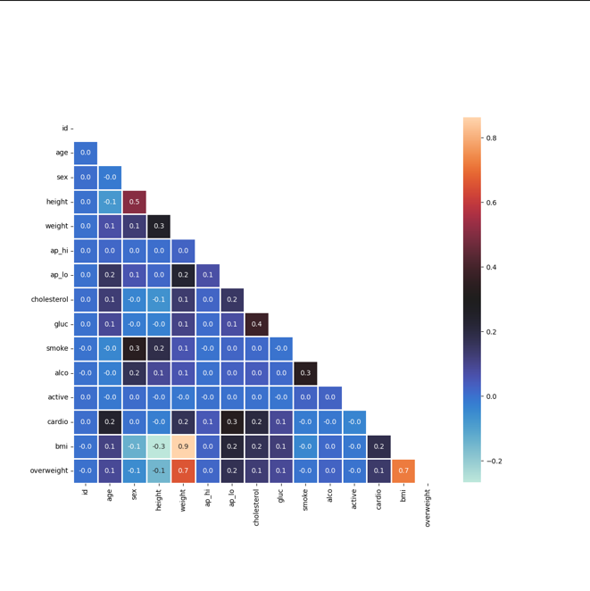

# medical_data_visualizer
#
#
🩺 Medical Data Analysis and Visualization

This project analyzes medical examination data to explore relationships between lifestyle habits, body metrics, and cardiovascular disease.
The dataset includes information such as height, weight, blood pressure, cholesterol level, glucose level, and whether a patient has cardiovascular disease.

Before visualization, the data is cleaned and normalized to make sure the results are meaningful and comparable.

What this project does

Loads medical examination data from a CSV file

Calculates BMI and creates an overweight indicator

Normalizes health indicators so that:

0 always represents a healthy condition

1 represents an unhealthy condition

Visualizes categorical health features grouped by cardiovascular disease status

Cleans incorrect or extreme data points before correlation analysis

Generates a heatmap to show correlations between medical features

Categorical Plot

The categorical plot compares lifestyle and health indicators (cholesterol, glucose, smoking, alcohol intake, physical activity, and overweight) for patients with and without cardiovascular disease.

The data is reshaped and grouped to count occurrences, making it easier to compare patterns between the two groups.

Heatmap

Before creating the heatmap, the data is filtered to remove:

Invalid blood pressure values

Extreme height and weight values

The heatmap shows correlations between numerical medical features, helping identify which factors are most strongly related to cardiovascular disease.

This project was completed as part of the freeCodeCamp Data Analysis with Python certification and focuses on data cleaning, feature engineering, and clear visual interpretation.

Technologies used

Python

Pandas

NumPy

Matplotlib

Seaborn
